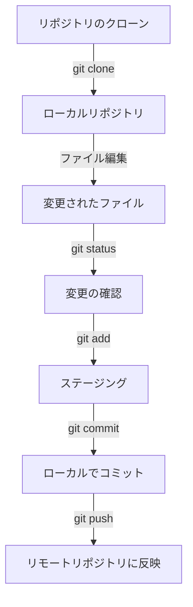

# GitHub ワークフロー

## 手順

1. **リポジトリのクローン**
   ```
   git clone https://github.com/username/repository.git
   cd repository
   ```

2. **ファイルの編集**
   好みのテキストエディタでファイルを開いて編集します。

3. **変更の確認**
   ```
   git status
   ```

4. **変更をステージング**
   ```
   git add .
   ```

5. **変更をコミット**
   ```
   git commit -m "変更内容の簡潔な説明"
   ```

6. **変更をリモートリポジトリにプッシュ**
   ```
   git push origin main
   ```

## ワークフローの図解



## 注意点

- `main`の部分は、リポジトリのデフォルトブランチ名に応じて`master`や他の名前に変更する必要がある場合があります。
- 大きな変更を行う場合は、新しいブランチを作成して作業することをお勧めします。
- `git push`の前に`git pull`を実行して、リモートの変更を取り込むことをお勧めします。
